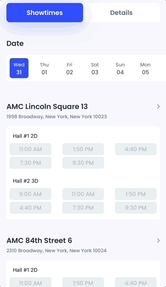

<br><br>
# MovieList


MovieList is a Swift component that features a carousel animation suitable for selecting a movie or an event by a mere swipe. 

- [Requirements](#requirements)
- [Installation](#installation)
- [License](#license)

MovieList allows the user to swipe through available movies or events, where the animation highlights the selected film by enlarging the preview.


Here is an example showing the movies carousel:


Once selected, the preview takes the whole screen, showing additional info about the movie:


The user can swipe down and see all the essential details about the movie or event, like plot, cast, screenshots, and trailers, then see showtime dates:



## Requirements

- iOS 11.0+
- Xcode 11.0+
- Swift 5.0+

## Installation

### CocoaPods

To integrate MovieList into your Xcode project with CocoaPods, specify it in your `Podfile`:

```ruby
pod 'MovieList', :git => 'https://github.com/shakurocom/MovieListDemo.git', :commit => d07ccab3ae9f15eeb021c23c018152fa86bd0acd
```

Then, run the following command:

```bash
$ pod install
```

### Manually

If you prefer not to use CocoaPods, you can integrate Shakuro.MovieList simply by copying it to your project.

## License

Shakuro.MovieList is released under the MIT license. [See LICENSE](https://github.com/shakurocom/ScrollableTabs/blob/master/LICENSE.md) for details.

## Give it a try and reach us

Star this tool if you like it, it will help us grow and add new useful things. 
Feel free to reach out and hire our team to develop a mobile or web project for you.

